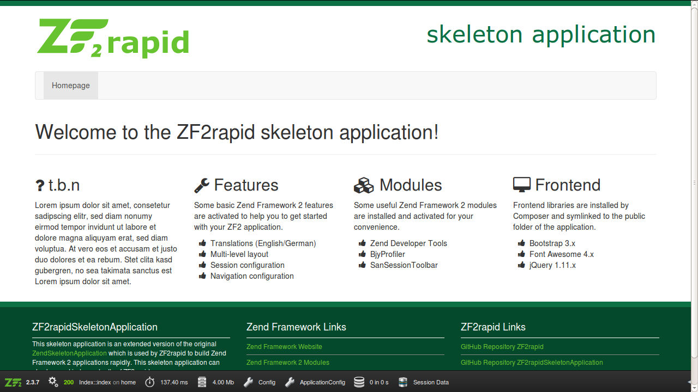

# ZF2rapid

Console application to create ZF2 application rapidly.

## Features

 * Create new projects based on Skeleton Applications
 * Create, delete, activate and deactivate modules
 * Create and delete controllers with or without factories
 * Create actions for controllers
 * Create routing for module with or without strict mode
 * Create other classes with or without factories
   * Controller plugins
   * Filters
   * Forms
   * Hydrators
   * Input filters
   * Validators
   * View helpers
 * Generate class and template maps for a module
 * Show modules, controllers and actions for a project
 * Show ZF2 version for a project
 * Show other classes for a project
   * Controller plugins
   * Filters
   * Forms
   * Hydrators
   * Input filters
   * Validators
   * View helpers
 * Show ZF2rapid version
 * Show and manipulate ZF2rapid configuration
 * Command line help for each command
 * Autocomplete support (does not work for PHAR file yet)

## Requirements

Please see the [composer.json](composer.json) file for all requirements.

## Warning

An important note for all Windows users. ZF2rapid is not tested on Windows yet!

## Installation

### Installation with ZIP file and Composer

Download the [ZIP file](https://github.com/ZFrapid/zf2rapid/archive/master.zip), 
unzip its contents and move all files to you prefered path.

```console
$ wget --output-document=zf2rapid.zip https://github.com/ZFrapid/zf2rapid/archive/master.zip
$ unzip zf2rapid.zip 
$ mv zf2rapid-master/ /my/zf2rapid/path/
```

Switch to the new path and run the following `composer` command:

```console
$ cd /my/zf2rapid/path
$ composer install
```

Show the ZF2rapid command overview:

```console
$ ./bin/zf2rapid.php
```

### Installation with PHAR file

tbd

## Quick-Guide

Create a new project to a custom path and switch to the new project path:

```console
$ zf2rapid create-project /path/to/mynewproject
$ cd /path/to/mynewproject/
```

Show installed modules, controllers and actions:

```console
$ zf2rapid show-modules 
$ zf2rapid show-controllers 
$ zf2rapid show-actions
```

Create a new module, a new controller with a factory and some new actions

```console
$ zf2rapid create-module Shop
$ zf2rapid create-controller Shop Basket -f
$ zf2rapid create-action Shop basket show
$ zf2rapid create-action Shop basket send
$ zf2rapid create-action Shop basket cancel
```

Show installed modules, controllers and actions again:

```console
$ zf2rapid show-modules 
$ zf2rapid show-controllers 
$ zf2rapid show-actions
```

Create routing for new module

```console
$  zf2rapid create-routing Shop -s
```

Create an Apache 2 virtual host `mynewproject` with the document root 
`mynewproject/public/`, enable it, add it to your `/etc/hosts` file and restart 
Apache 2: 

    <VirtualHost *:80>
        ServerName mynewproject
        DocumentRoot /path/to/mynewproject/public/
        
        SetEnv APPLICATION_ENV development
        
        <Directory "/path/to/mynewproject/public/">
            DirectoryIndex index.php
            AllowOverride All
            Require all granted
        </Directory>
    </VirtualHost>

Run project in your browser:

 * [http://mynewproject/](http://mynewproject/)
 * [http://mynewproject/shop/basket/show](http://mynewproject/shop/basket/show)

The screen should look like this:



## Command-Guide

### Help

For each command you can display the command help with all supported arguments.

```console
$ zf2rapid help create-module 
```

### Projects

When creating a new project you need to specify the `<path>` to create the 
project in. You will be asked which Skeleton Application you want to install. 
After project creation you should switch to the new project path.

```console
$ zf2rapid create-project <path>
```

### Project configuration

You can list the configuration for the current project.

```console
$ zf2rapid tool-config
```

You can display the value for a configuration single configuration key, for 
example the namespace to be used for hydrators.

```console
$ zf2rapid tool-config --configKey=namespaceHydrator
```

You can change the value for a configuration single configuration key, for 
example the namespace to be used for hydrators (Please note that you need to 
use the double backslash to define a namespace with at least two levels).

```console
$ zf2rapid tool-config --configKey=namespaceHydrator --configValue=Model\\Hydrator
```

### Modules

When creating a new module you need to specify the `<module>`. Optionally, you 
can specify the `<path>` of the Zend Framework 2 project to create the new
module in. You will be asked in which application configuration file the new 
module should be activated.

```console
$ zf2rapid create-module <module> [<path>]
```

You can activate a module manually for any application configuration file. You
need to specify the `<module>` and optionally the `<path>` of the Zend 
Framework 2 project.
 
```console
$ zf2rapid activate-module <module> [<path>]
```

You can deactivate a module manually in any application configuration file. You
need to specify the `<module>` and optionally the `<path>` of the Zend 
Framework 2 project.
 
```console
$ zf2rapid deactivate-module <module> [<path>]
```

You can delete a module `<module>`. Optionally, you can specify the `<path>` of 
the Zend Framework 2 project to delete the module from.
 
```console
$ zf2rapid delete-module <module> [<path>]
```

You can display all modules of the current Zend Framework 2 project. Optionally, 
you can specify the `<path>` of the Zend Framework 2 project to display the 
modules from.

```console
$ zf2rapid show-modules [<path>]
```

### Controllers

### Actions

### Routing

### Maps

### Controller plugins

### View helpers

### Filters

### Validators

### Input Filters

### Forms

### Hydrators

## Roadmap

### Version 0.5.0

* Write documentation                           (in progress)
* Write tutorial                                (todo)

### Version 0.6.0

* Write tests for ZF2rapid                      (todo)

### Version 0.7.0

* Add CRUD commands                             (todo)

### Version 0.8.0

* Add module inspections                        (todo)
