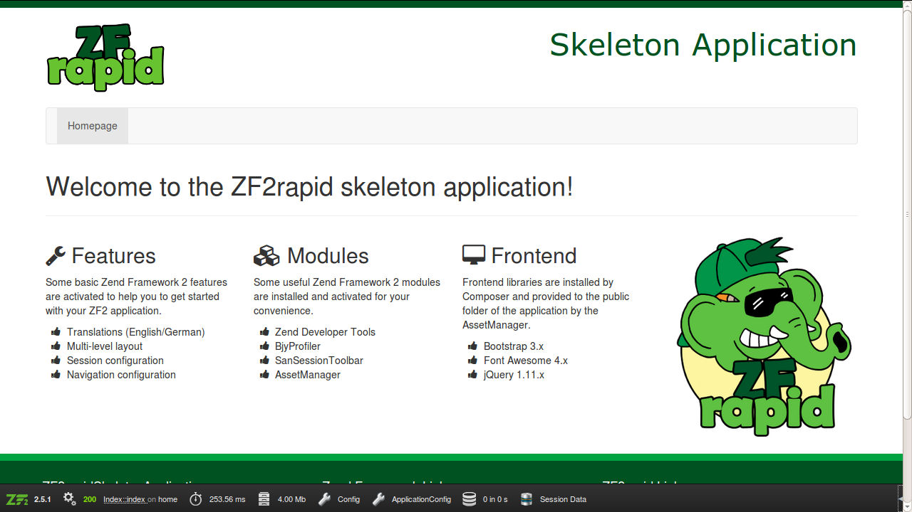
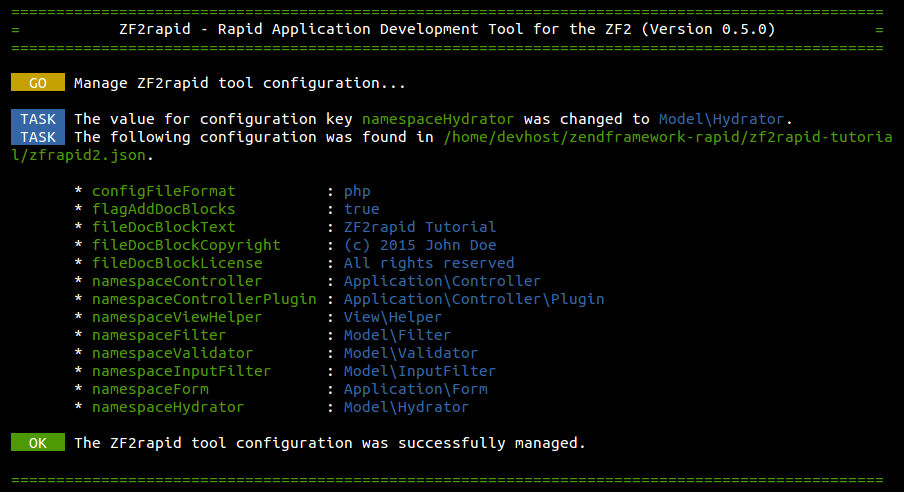

# ZF2rapid tutorial

In this tutorial you will learn how to create an application step by step with
ZF2rapid.

 * [Create new project](tutorial-create-project.md)
 * [Create new module](tutorial-create-module.md)
 * [Create controllers and actions](tutorial-create-controllers-actions.md)
 * [Create routing and generate maps](tutorial-create-routing-maps.md)
 * [Create controller plugin and view helper](tutorial-create-controller-plugin-view-helper.md)

## Create new project

When creating a new project you can choose from different Skeleton Applications 
to be installed. After choosing option 3. you need to specify the URL to a ZIP 
file with your custom Skeleton Application.

 1. Official Zend Skeleton Application
 2. ZF2rapid Skeleton Application
 3. Your Skeleton Application

To create a new project you need to specify the path of the new project. 
Assuming that all your projects are placed in the path `/home/devhost` the 
command to create a new project for this tutorial below this path could be as 
follows:

    $ zf2rapid create-project --workingPath=/home/devhost/zf2rapid-tutorial

The following tasks are executed when creating a new project:

 * Create project path
 * Download chosen Skeleton Application
 * Unzip chosen Skeleton Application
 * Self-updating Composer
 * Installing dependencies with Composer
 * Prepare project (set user rights and copy config files)
 
When the installation was successful you need to change the working dir to 
your new project path:

    $ cd /home/devhost/zf2rapid-tutorial

The installation of the new project is finished now.

## View new project in browser

To view the new project in your browser you need to do some further work. We are
assuming that you are using Apache 2 and want to create a 
Virtual Host now. Please refer to the official 
[Apache Virtual Host documentation](http://httpd.apache.org/docs/2.2/en/vhosts/)
for more details.

On **Ubuntu Linux** please create the new file 
`/etc/apache2/sites-available/zf2rapid.tutorial.conf` with the following 
content:

    <VirtualHost 127.0.0.1>
	    ServerName zf2rapid.tutorial
	    DocumentRoot /home/devhost/zf2rapid-tutorial/public/
    	AccessFileName .htaccess

        SetEnv APPLICATION_ENV development

	    <Directory "/home/devhost/zf2rapid-tutorial/public/">
		    DirectoryIndex index.php
		    AllowOverride All
		    Require all granted
	    </Directory>
    </VirtualHost>

Add the new virtual host to your `/etc/hosts` file:

    [...]
    127.0.0.1	zf2rapid.tutorial

Enable new virtual host:

    $ sudo a2ensite zf2rapid.tutorial.conf 

Restart Apache 2:

    $ sudo service apache2 restart

Now you can open your new project in your prefered browser by calling the URL 
[http://zf2rapid.tutorial](http://zf2rapid.tutorial). Your screen should look 
like this:

## Configure your project

Before you continue to create modules, controllers and other stuff you should 
take some time and configure your new project. To start with the configuration 
you can list all options:

    $ zf2rapid tool-config

The following configuration keys can be changed for your current project:

| Option                    | Description                                                 | 
| ------------------------- | ----------------------------------------------------------- | 
| configFileFormat          | format of the configuration files (not supported yet)       | 
| flagAddDocBlocks          | whether to automatically create doc blocks or not           | 
| fileDocBlockText          | text to be used in a file doc block                         | 
| fileDocBlockCopyright     | copyright to be used in a file doc block                    | 
| fileDocBlockLicense       | license to be used in a file doc block                      | 
| namespaceController       | namespace for all controller classes within a module        | 
| namespaceControllerPlugin | namespace for all controller plugin classes within a module | 
| namespaceViewHelper       | namespace for all view helper classes within a module       | 
| namespaceFilter           | namespace for all filter classes within a module            | 
| namespaceValidator        | namespace for all validator classes within a module         | 
| namespaceInputFilter      | namespace for all input filter classes within a module      | 
| namespaceForm             | namespace for all form classes within a module              | 
| namespaceHydrator         | namespace for all hydrator classes within a module          |

First, we want to change the data for the file doc blocks.

    $ zf2rapid tool-config --configKey=fileDocBlockText --configValue="ZF2rapid Tutorial"
    $ zf2rapid tool-config --configKey=fileDocBlockCopyright --configValue="(c) 2015 Your Name"
    $ zf2rapid tool-config --configKey=fileDocBlockLicense --configValue="All rights reserved"

Second, we want to change the default structure of the namespaces for the 
classes that we will create later on.

    $ zf2rapid tool-config --configKey=namespaceController --configValue="Application\\Controller"
    $ zf2rapid tool-config --configKey=namespaceControllerPlugin --configValue="Application\\Controller\\Plugin"
    $ zf2rapid tool-config --configKey=namespaceFilter --configValue="Model\\Filter"
    $ zf2rapid tool-config --configKey=namespaceValidator --configValue="Model\\Validator"
    $ zf2rapid tool-config --configKey=namespaceInputFilter --configValue="Model\\InputFilter"
    $ zf2rapid tool-config --configKey=namespaceForm --configValue="Application\\Form"
    $ zf2rapid tool-config --configKey=namespaceHydrator --configValue="Model\\Hydrator"

Your console screen should look like this, after changing the project 
configuration:

If you want to create the project configuration file by hand, please open the 
`zfrapid2.json` file and change the configuration values manually. Make sure 
not to overwrite or change any of the configuration keys. After our changes, 
the file should look like this:
 
    {
      "configFileFormat": "php",
      "flagAddDocBlocks": "true",
      "fileDocBlockText": "ZF2rapid Tutorial",
      "fileDocBlockCopyright": "(c) 2015 John Doe",
      "fileDocBlockLicense": "All rights reserved",
      "namespaceController": "Application\\Controller",
      "namespaceControllerPlugin": "Application\\Controller\\Plugin",
      "namespaceViewHelper": "View\\Helper",
      "namespaceFilter": "Model\\Filter",
      "namespaceValidator": "Model\\Validator",
      "namespaceInputFilter": "Model\\InputFilter",
      "namespaceForm": "Application\\Form",
      "namespaceHydrator": "Model\\Hydrator"
    }

Now you are ready to create a new module for your Zend Framework 2 project.

[Continue to create a new module](tutorial-create-module.md)
